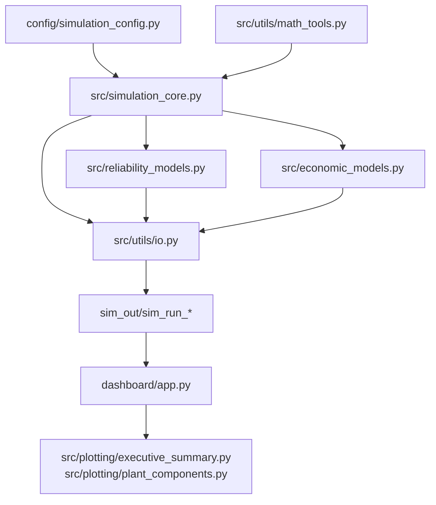

## 1. **Introduction**
- The Meta-System Modeling and Simulation Framework instantiates a coal-fired generation asset as a canonical complex system, capturing fuel handling, thermal conversion, cooling, and water-treatment loops alongside stochastic outages drawn from `src/simulation_core.py`.
- By generalising nuclear/thermal power plant dynamic modelling into a decision-support context, the platform couples first-order process physics, Monte Carlo reliability, and economic scoring so panel reviewers can evaluate operational trade-offs with real data artifacts.

## 2. **Objectives**
- Simulate tightly coupled fuel, steam, turbine, condenser, and water-treatment dynamics using configurable parameters from `config/simulation_config.py`.
- Quantify stochastic availability via exponential MTBF/MTTR sampling in `src/reliability_models.py`, and feed composite reliability indices into downstream KPIs.
- Convert electrical output and fuel use into revenue, cost, carbon, and profitability metrics through `src/economic_models.py` for scenario economics.
- Persist every run as CSV/JSON bundles with `src/utils/io.py` so analyses remain reproducible and auditable.
- Surface executive-ready dashboards in `dashboard/app.py` using Plotly figures supplied by `src/plotting/*`, giving stakeholders interactive KPI and subsystem views.

## 3. **Block Diagram**

## 4. **Simulation Diagram / Hardware Circuit**
- **Coal & Handling:** Inventory evolves from rail delivery to conveyor commands, with cleaning efficiency and conveyor response (`COAL_FLOW_RESPONSE_TAU_S`, `HANDLING_RESPONSE_TAU_S`) mapping to mechanical delays.
- **Boiler & Steam Path:** Thermal mass lags, economiser, air-preheater, and superheater temperatures follow first-order responses (`TEMP_RESPONSE_TAU_S`, gain coefficients) to coal feed, mirroring boiler drum and superheat sections.
- **Turbine-Generator:** Steam flow and turbine efficiency translate into electrical power (`power_W`) subject to availability gating, representing shaft/alternator performance.
- **Condensing & Cooling:** Exhaust, condenser, and cooling-water temperatures are moderated by feedback loops with their own time constants, approximating shell-and-tube heat exchange.
- **Feedwater & Treatment:** Feedwater flow, heater outlet, and makeup water dynamics (`FW_FLOW_RESPONSE_TAU_S`, `WATER_FLOW_RESPONSE_TAU_S`) link condenser returns to boiler demand.
- **Reliability Envelope:** Exponentially distributed outages throttle subsystem commands, emulating breaker trips or maintenance downtime cascading across the circuit.

## 5. **Work Done So Far**
- `src/simulation_core.py` orchestrates the 30-year (262,800 h) timestep loop, blending demand waves, first-order filters, outage-aware clamps, Monte Carlo sampling, and KPI assembly.
- `src/reliability_models.py` provides renewal-process outage synthesis, event bookkeeping, and composite indices weighting uptime versus derated performance.
- `src/economic_models.py` integrates power and coal traces to compute total energy, cost stack, carbon penalties, and profit margins.
- `src/utils/io.py` standardises run directory creation, CSV/JSON persistence, and cached loaders for dashboard reuse; `src/utils/math_tools.py` houses reusable clamp and response functions.
- `src/plotting/executive_summary.py` and `src/plotting/plant_components.py` build stacked-cost, revenue, gauge, and 4x3 subsystem plots directly from archived run data.
- `dashboard/app.py` delivers Dash tabs for KPI summaries and subsystem dynamics, auto-discovering runs via dropdowns and exposing assumption tables.
- `config/simulation_config.py` centralises all process, reliability, and economic constants while publishing derived hours for dependent modules.

## 6. **Results and Discussion**
- Latest archive `sim_out/sim_run_2025-10-15_22-31_262800h` simulates 10,950 days, exporting 120,554,681 MWh (capacity factor 83.41%) and 49.67 million tons of coal consumption (`KPIs.json`).
- Financially, revenue reaches 8.78 B units while costs total 11.29 B, yielding a -2.51 B net profit and -28.6% margin under current carbon pricing and O&M assumptions.
- Reliability metrics report 95.46% uptime, 11,941.8 downtime hours, MTBF 73.09 h, MTTR 3.48 h, and 3,432 logged outage events (`reliability.json`), with composite reliability index at 97.0%.
- Monte Carlo post-processing shows uptime mean 95.36% ± 0.10 and downtime mean 12,194.7 h ± 271.5, validating the stability of availability predictions.
- Dashboard views overlay KPI cards, stacked cost bars, revenue/profit comparisons, uptime gauge, and 12-subplot component trends, enabling quick diagnostic storytelling for panel slides.

## 7. **Work Pending**
- Integrate the roadmap’s carbon-capture subsystem and associated cost/benefit streams to extend beyond conventional plant boundaries (README §10).
- Develop optimisation or reinforcement-learning controllers for fuel and feedwater scheduling to replace the open-loop demand wave noted in `src/simulation_core.py`.
- Expand persistence beyond CSV to Parquet or database sinks for high-volume analytics, as envisaged in the roadmap.
- Differentiate reliability events by subsystem and propagate non-unity performance ratios through Monte Carlo runs (currently unity arrays in `run_monte_carlo_reliability`).

## 8. **Conclusion**
- The framework unifies configurable process dynamics, stochastic reliability, economic accounting, and interactive dashboards, creating a reusable template for meta-system decision analysis.
- With long-horizon runs already archived and visualised, the project is ready for scenario exploration while leaving clear hooks for advanced control and sustainability layers.

## 9. **References**
- NumPy Developers. *NumPy* — numerical arrays and integration used across simulation (`src/simulation_core.py`).
- pandas Development Team. *pandas* — tabular storage for results archives and dashboard ingestion (`src/simulation_core.py`, `dashboard/app.py`).
- Plotly. *Plotly Graph Objects* — KPI and subsystem visualisations (`src/plotting/*`).
- Plotly. *Dash* — interactive dashboard framework powering `dashboard/app.py`.
